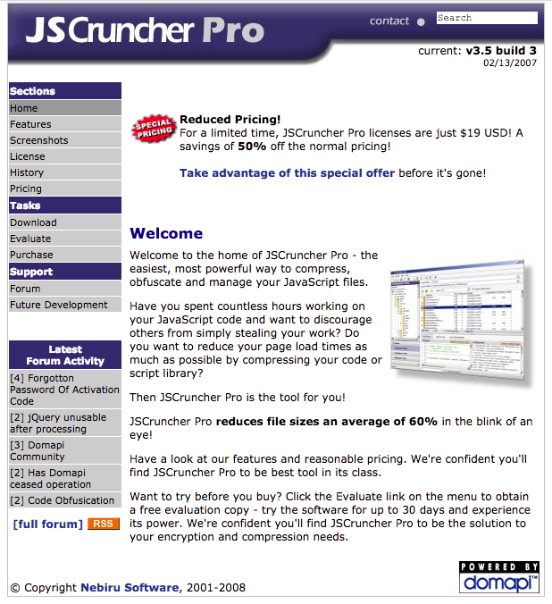

# JSCruncher Pro

This is the open sourced version of JSCruncher Pro 3.5, written in Delphi 3 and kept current through to Delphi 7.

JSCruncher Pro was the first commercial JavaScript obfuscator and compressor.  It saw heavy usage and growth from 2001 until roughly 2008, when sales dropped off due to the emergence of open sourced compressors.

Please feel free to fork this repository and do what you will with the code.
This repository contains both the Windows GUI and CLI implementations, along with the installer and assorted utilities.

The original site, complete with the old discussion forums can be found on the [Wayback Machine](https://web.archive.org/web/20110623174247/http://domapi.com:80/jscruncherpro/).

